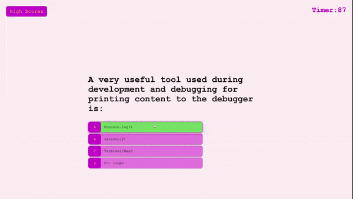

# A Coding Quiz
A timed multiple choice coding quiz application, using HTML, CSS, and Javascript.

## Description
Answer the questions correctly and try and get yourself to the top five list in the high scores, but beware of wrong answers they subtract from your time!

## Example

### Resources
Vanderbilt Full-Stack Web Developer Course  
James Q Quick was an amazing resource and his YouTube channel is linked below.  
(https://www.youtube.com/channel/UC-T8W79DN6PBnzomelvqJYw)  

All the different forums and the countless users on them that helped me: 
### GitHub
### StackOverflow
### CodePen
### Codecademy
### Coursera
### Udemy
